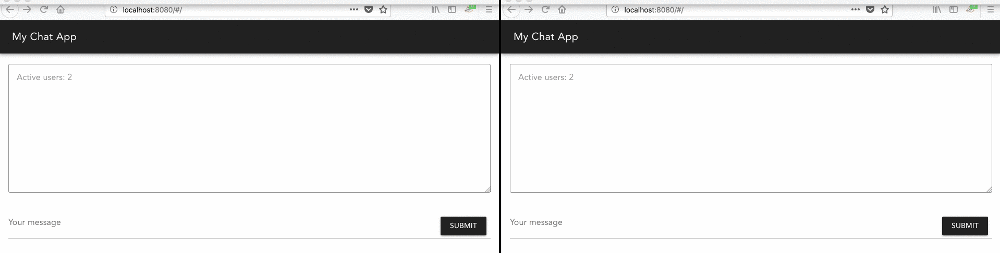

# node-vue-websockets

A demo repository integrating Vue.js, Node.js, material design and websockets.

See my [blog post](https://anoff.io/blog/2018-04-18-node-vue-websockets/) detailing the contents of this repository.

Ultimately you get a very simple chat server:

## License

Some of the code in this repository comes form the `vue-cli` boilerplate, the rest can be considered MIT
